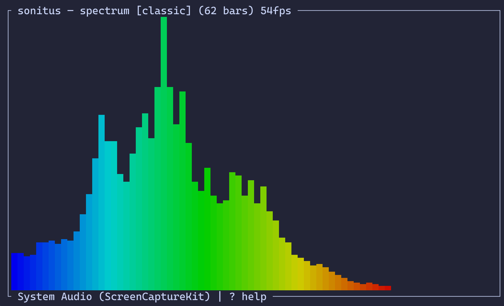
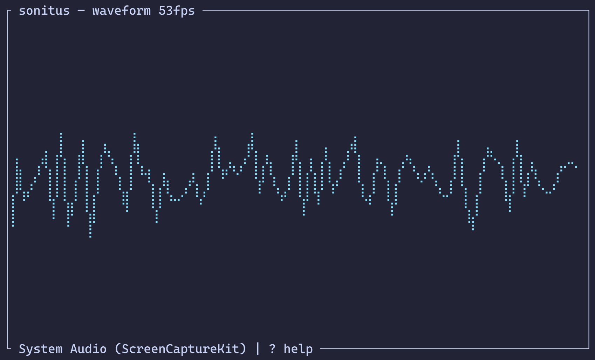
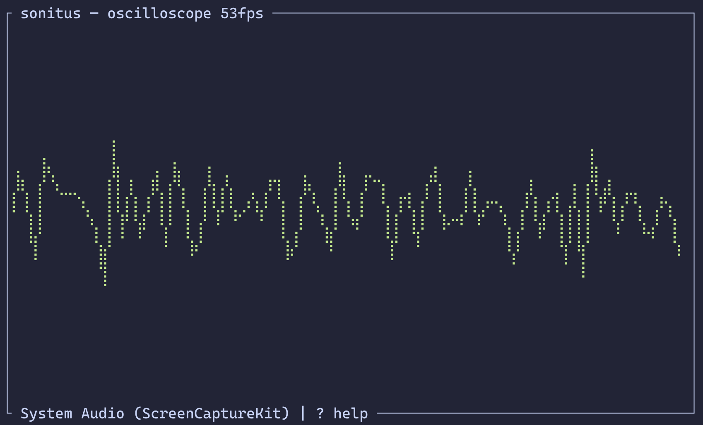
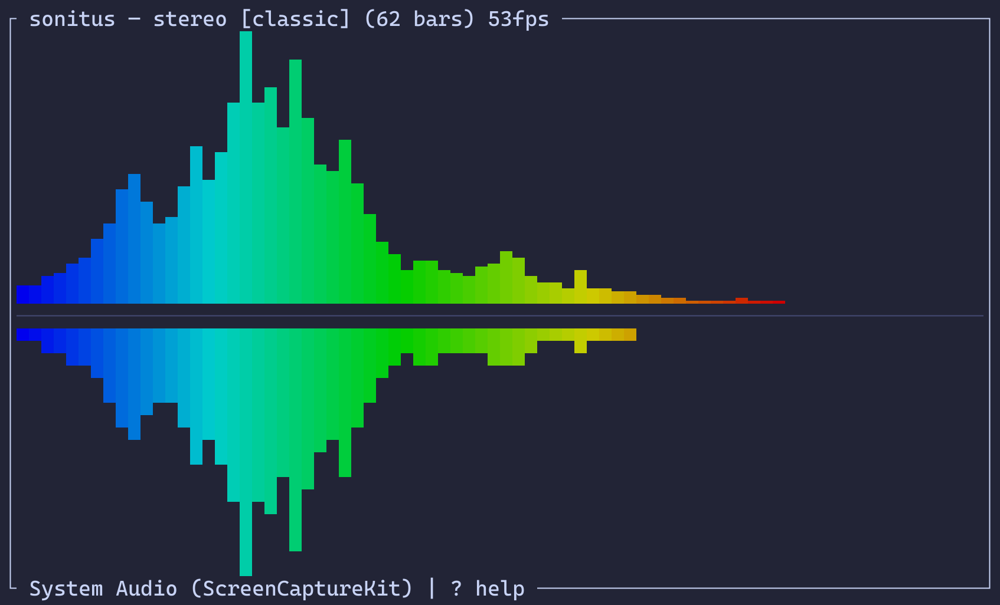

# sonitus

Terminal audio visualizer for macOS. Renders real-time spectrum bars, waveforms, oscilloscopes, and stereo visualizations from mic input or system audio.



## Install

Requires Rust and (optionally) Swift for system audio capture.

```
just
```

This builds and installs `sonitus` and `sonitus-tap` to `~/.cargo/bin`.

## Usage

```
sonitus                        # spectrum visualizer (system audio by default)
sonitus --mode wave            # waveform mode
sonitus --mode scope           # oscilloscope mode
sonitus --mode stereo          # stereo L/R visualization
sonitus --device "system"      # capture system audio (requires sonitus-tap)
sonitus --theme fire           # use the fire color theme
sonitus --bars 128             # set number of spectrum bars
sonitus --list-devices         # list available audio devices
```

## Keybindings

| Key | Action |
|-----|--------|
| `?` | Help |
| `m` | Cycle visualization mode |
| `d` | Select audio device |
| `t` | Select color theme |
| `s` | Settings menu |
| `Up` / `+` | More bars |
| `Down` / `-` | Fewer bars |
| `q` / `Esc` | Quit |

## Modes

- **spectrum** — frequency bars with color gradient and gravity fall-off
- **wave** — real-time waveform amplitude plot
- **scope** — oscilloscope with zero-crossing trigger
- **stereo** — left channel bars up, right channel bars down from center

| | |
|---|---|
|  |  |
|  | |

## Themes

Seven built-in color themes, selectable via `--theme` or `t` at runtime:

- **classic** — blue, cyan, green, yellow, red
- **fire** — dark red to bright yellow
- **ocean** — deep navy to bright aqua
- **purple** — dark violet to pink
- **matrix** — green monochrome
- **synthwave** — indigo, violet, magenta, pink, orange
- **mono** — grayscale

## Settings

Press `s` to open the settings menu. Adjust with arrow keys or vim bindings:

- **Smoothing** — temporal smoothing between frames (0.0–0.99)
- **Monstercat** — smooth envelope connecting bar tops
- **Noise floor** — threshold to zero out quiet bars
- **Gradient mode** — color by amplitude or by bar position

All settings persist to `~/.config/sonitus/config.toml`.

## System audio capture

To visualize audio from Apple Music or other apps, sonitus uses a companion Swift binary (`sonitus-tap`) that captures system audio via ScreenCaptureKit.

**Requirements:**
- macOS 13+
- Screen Recording permission must be granted to your terminal app (System Settings > Privacy & Security > Screen Recording)

Select "System Audio (ScreenCaptureKit)" from the device menu (`d`), or pass `--device system`.

**Alternative:** Install [BlackHole](https://github.com/ExistentialAudio/BlackHole), create a Multi-Output Device in Audio MIDI Setup (speakers + BlackHole), set it as your output, then select "BlackHole 2ch" as the input device.
